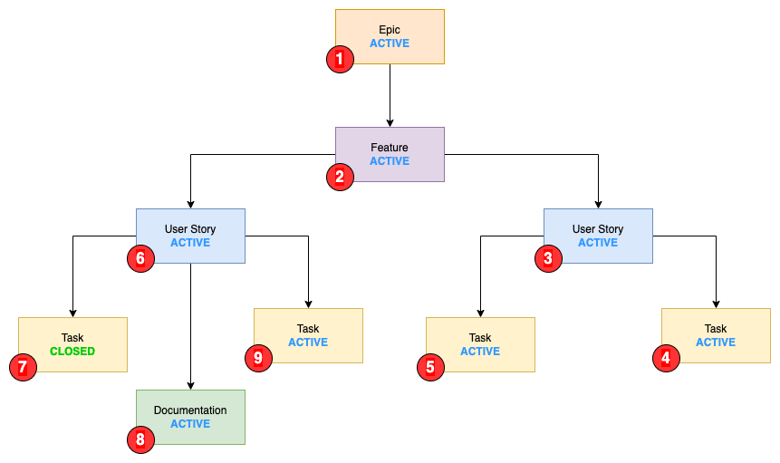
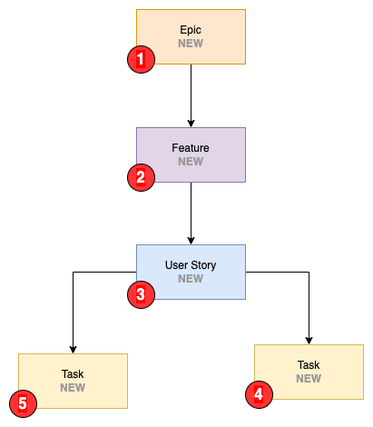

# Parent Rules

Parent Rules update the state or fields of a parent work item when one of its child work items transitions to a specific state.

## Create Your First Parent Rule

1. Open **Project Settings** -> **Extensions** -> **COSMO Smart Automate** -> **Parent Rules**.
2. Select **Add Rule**.
3. Select the child **Work item type**, its **Transition state**, and the parent **Parent type**.
4. Optionally select states in **Parent not in state**, then select the **Parent target state**.
5. Optionally add a **Field Setter** or enable **Children lookup**.
6. Save the rule and use **Rule Tester** to preview the changes before using it in production.

Leave the parent state settings empty to create a field-only rule. The rule applies its configured parent field setters without changing the parent state.

## Parent Rule Fields

| Field               | Description                                                                                                                      |
| ------------------- | -------------------------------------------------------------------------------------------------------------------------------- |
| Work item type      | This is the work item type for this rule to trigger on                                                                           |
| Parent type         | This is the work item type of the parent relation. E.g the work item type that should be updated.                                |
| Transition state    | The transitioned state for the rule to trigger on (When work item type changes to this) state                                    |
| Parent not in state | Optional: Do not trigger the rule if the parent work item is in one of these states                                               |
| Parent target state | Optional: The state that the parent work item should transition to; choose from the states selected in Parent not in state       |
| Field Setter        | Optional: Set parent field values without changing its state                                                                       |
| Children lookup     | Take child work items into consideration when processing the rule. See [Children lookup](#children-lookup) for more information. |

`Children lookup` is only evaluated for rules with a parent target state.

## Children Lookup

This option is in most cases only needed when setting the parent state to something like `Resolved` or `Closed`. When `Children lookup` is turned on, the rule system takes child work items into consideration when processing work items.

As a general rule:

| Category group | Use `Children lookup` |
| -------------- | --------------------- |
| Proposed       | No                    |
| In Progress    | No                    |
| Resolved       | Yes                   |
| Completed      | Yes                   |
| Removed        | Yes                   |

To better explain this, let us look at the following setup:

### Example One - Closing a User Story

Take the following rule:

| Field               | Rule One                        |
| ------------------- | ------------------------------- |
| Work item type      | `Task`                          |
| Parent type         | `User Story`                    |
| Transition state    | `Closed`                        |
| Parent not in state | `Resolved`, `Closed`, `Removed` |
| Parent target state | `Resolved`                      |
| Children lookup     | `False`                         |

When setting `Task (4)` to `Closed`, it will update `User Story (3)` to `Resolved`.

If `Children lookup` was set to `True` for this rule, it would check all other child work items of `User Story (3)` where the target state is the same as the one defined for this rule.

For this scenario it would not change the state of `User Story (3)`, since `Task (5)` does not match the rule condition. If the state of `Task (5)` was `Closed`, it would update the state of `User Story (3)`.

### Example Two - Closing a User Story with Multiple Types as Children

Take the following rule:

| Field               | Rule One                        |
| ------------------- | ------------------------------- |
| Work item type      | `Documentation`                 |
| Parent type         | `User Story`                    |
| Transition state    | `Closed`                        |
| Parent not in state | `Resolved`, `Closed`, `Removed` |
| Parent target state | `Closed`                        |
| Children lookup     | `False`                         |

When setting `Documentation (8)` to `Closed`, it will update `User Story (6)` to `Closed`.

If `Children lookup` was set to `True` for this rule, it would check all other child work items of `User Story (8)` where the target state is the same as the one defined for this rule. Since this parent has two different types of child items (`Documentation` and `Task`) a rule would need to be defined for both of them.

### Example Three - Activating the Parent

Take the following rule:

| Field               | Rule One                                  |
| ------------------- | ----------------------------------------- |
| Work item type      | `Task`                                    |
| Parent type         | `User Story`                              |
| Transition state    | `Active`                                  |
| Parent not in state | `Active`, `Resolved`, `Closed`, `Removed` |
| Parent target state | `Active`                                  |
| Children lookup     | `False`                                   |

When setting `Task (5)` to `Active`, it will update `User Story (3)` to `Active`.

## Process Parents

Setting `Process parents` to `On` will process rules for the parent work item type when finding a rule that matches.

Consider the three following rules:

Rules for `Task`:

| Field               | Rule                                      |
| ------------------- | ----------------------------------------- |
| Work item type      | `Task`                                    |
| Parent type         | `User Story`                              |
| Transition state    | `Active`                                  |
| Parent not in state | `Active`, `Resolved`, `Closed`, `Removed` |
| Parent target state | `Active`                                  |
| Children lookup     | `False`                                   |
| Process parent      | `True`                                    |

Rules for `User Story`:

| Field               | Rule                                      |
| ------------------- | ----------------------------------------- |
| Work item type      | `User Story`                              |
| Parent type         | `Feature`                                 |
| Transition state    | `Active`                                  |
| Parent not in state | `Active`, `Resolved`, `Closed`, `Removed` |
| Parent target state | `Active`                                  |
| Children lookup     | `False`                                   |
| Process parent      | `True`                                    |

Rules for `Feature`:

| Field               | Rule                                      |
| ------------------- | ----------------------------------------- |
| Work item type      | `Feature`                                 |
| Parent type         | `Epic`                                    |
| Transition state    | `Active`                                  |
| Parent not in state | `Active`, `Resolved`, `Closed`, `Removed` |
| Parent target state | `Active`                                  |
| Children lookup     | `False`                                   |
| Process parent      | `False`                                   |

When a `Task` is updated from `New -> Active` this will set the state of the parent `User Story` to `Active`. Since `Process parent` is turned on here, COSMO Smart Automate will then process rules for `User Story` and so on.

This means that with the rules defined above, and the following as the initial states of the work item hierarchy:

- Task: `New`
- User Story: `New`
- Feature: `New`

We will end up with the following states after `Task` is set to `Active` and processing is completed:

- Task: `Active`
- User Story: `Active`
- Feature: `Active`

## Managing Parent Rules

The **Clear all rules** action asks for confirmation before removing all Parent Rules in the current project. It does not remove Work Item Calculation Rules or Sibling Rules.

Equivalent Parent Rule configurations cannot be created more than once. This duplicate check ignores the generated rule ID, so copying or importing an equivalent rule skips it.

## Import and Export

Use the **Import / Export** page to export one or more rule sets or import a rule bundle. Exports are written to `cosmo-smart-automate-rules-<scope>-<date>.json`.

The import panel shows how many rules of each type the selected file contains before importing. After the import, a notification reports the number imported and the number skipped as duplicates, for example:

`Imported 0 rules. Skipped 21 duplicates.`

New configurations receive normal project-local rule IDs. A rule with the same ID but changed configuration updates the existing rule.

The bundle reserves an optional `childCalculationRules` collection for the planned Child Calculation Rules engine; current releases do not import non-empty child calculation data.