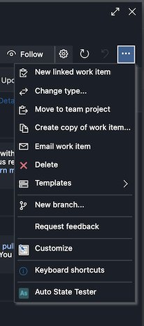

# COSMO Smart Automate Documentation

Welcome to the COSMO Smart Automate documentation.

COSMO Smart Automate is a rule-based extension for automating Azure DevOps work item state and field updates. It supports multiple rule types:

- **Parent Rules** - Automatically update parent work item states or fields based on child changes
- **Sibling Rules** - Coordinate state or field updates between related tasks (siblings with the same parent)
- **Work Item Calculation Rules** - Calculate field values from work item fields and constants
- **Child Calculation Rules** - Planned calculations that aggregate child work items into parent fields

## Quick Links

- [Parent Rules Guide](./PARENT_RULES.md) - Create rules that update parent work items
- [Calculation Rules Guide](./CALCULATION_RULES.md) - Calculate work item fields from fields and constants
- [Sibling Rules Guide](./SIBLING_RULES.md) - Learn about coordinating related tasks
- [Settings](./SETTINGS.md) - Configure COSMO Smart Automate behavior
- [Preset rules](./PRESETS.md) - Ready-to-use rule templates

## Where COSMO Smart Automate Works

COSMO Smart Automate integrates with Azure DevOps work item tracking and automatically triggers rules when you update a work item. The following areas are fully supported:

| View              | Status                                                                             |
| ----------------- | ---------------------------------------------------------------------------------- |
| Work item form    | Fully working                                                                      |
| Backlog           | Fully working                                                                      |
| Boards            | Does not work                                                                      |
| Query result view | Does not work                                                                      |

> **Note:** Rules execute when you save a configured trigger-state change directly in the work item form or through the backlog. A rule can then update fields without changing the target work item state. The boards view and query result view do not currently support the event hooks needed for rule execution.

Boards and query result views do not expose the contribution types required for the extension to hook into work item changes.

## Rules

For details on how to configure Parent Rules, see [Parent Rules](./PARENT_RULES.md).

## Testing Rules

The Rule Tester allows you to perform a dry run of rules to see how it will update work items.

You can find the rule tester in two places:

1. From the admin page. Here you can test rules for all work items.

   

2. From the individual work item. Here you can test rules for the current work item.

   

The rule tester will show all work items that will be changed.

