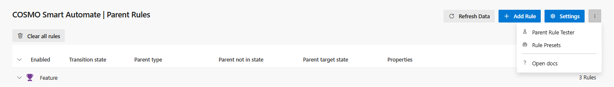
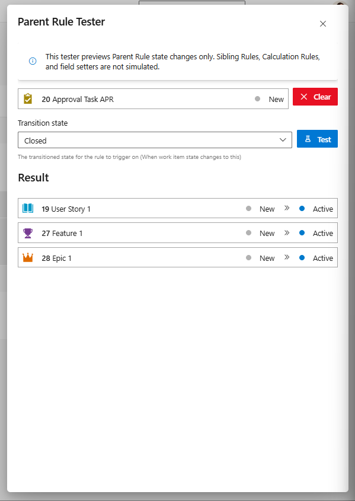

# COSMO Smart Automate Documentation

Welcome to the COSMO Smart Automate documentation.

COSMO Smart Automate is a rule-based extension for automating Azure DevOps work item state and field updates. It supports multiple rule types:

- **Parent Rules** - Automatically update parent work item states or fields based on child changes
- **Sibling Rules** - Coordinate state or field updates between related tasks (siblings with the same parent)
- **Work Item Calculation Rules** - Calculate field values from work item fields and constants
- **Child Calculation Rules** - Planned calculations that aggregate child work items into parent fields

## Quick Links

- [Parent Rules Guide](./PARENT_RULES.md) - Create rules that update parent work items
- [Calculation Rules Guide](./CALCULATION_RULES.md) - Calculate work item fields from fields and constants
- [Sibling Rules Guide](./SIBLING_RULES.md) - Learn about coordinating related tasks
- [Import / Export Guide](./IMPORT_EXPORT.md) - Move rule sets between projects with JSON bundles
- [Settings](./SETTINGS.md) - Configure COSMO Smart Automate behavior
- [Preset rules](./PRESETS.md) - Ready-to-use rule templates

## Where COSMO Smart Automate Works

COSMO Smart Automate integrates with Azure DevOps work item tracking and automatically triggers rules when you update a work item. The following areas are fully supported:

| View              | Status                                                                             |
| ----------------- | ---------------------------------------------------------------------------------- |
| Work item form    | Fully working                                                                      |
| Backlog           | Fully working                                                                      |
| Boards            | Does not work                                                                      |
| Query result view | Does not work                                                                      |

> **Note:** Rules execute when you save a configured trigger-state change directly in the work item form or through the backlog. A rule can then update fields without changing the target work item state. The boards view and query result view do not currently support the event hooks needed for rule execution.

Boards and query result views do not expose the contribution types required for the extension to hook into work item changes.

## Rules

For details on how to configure the supported rule types, see:

- [Parent Rules](./PARENT_RULES.md) - Update parent work items when child work items change
- [Sibling Rules](./SIBLING_RULES.md) - Coordinate state or field updates between related work items
- [Calculation Rules](./CALCULATION_RULES.md) - Calculate work item fields from fields and constants

## Testing Parent Rules

The Parent Rule Tester performs a dry run of **Parent Rules** to show which parent work items would change state.

From the admin page, you can test Parent Rules for any work item.

   

The Parent Rule Tester shows every parent work item that would change state. When no state change is predicted, it explains why, for example because the work item has no parent, because no enabled rule matched, or because children lookup blocked the transition.

### What the Parent Rule Tester does not cover

- **Sibling Rules** and **Calculation Rules** are not simulated.
- **Field Setters** are not previewed. A Parent Rule that only sets fields is reported as matching, but the field values it would write are not shown.
- Azure DevOps process rules are not evaluated, so a previewed transition can still be rejected on save.
- The preview is a snapshot. Concurrent edits between testing and saving can change the outcome.
